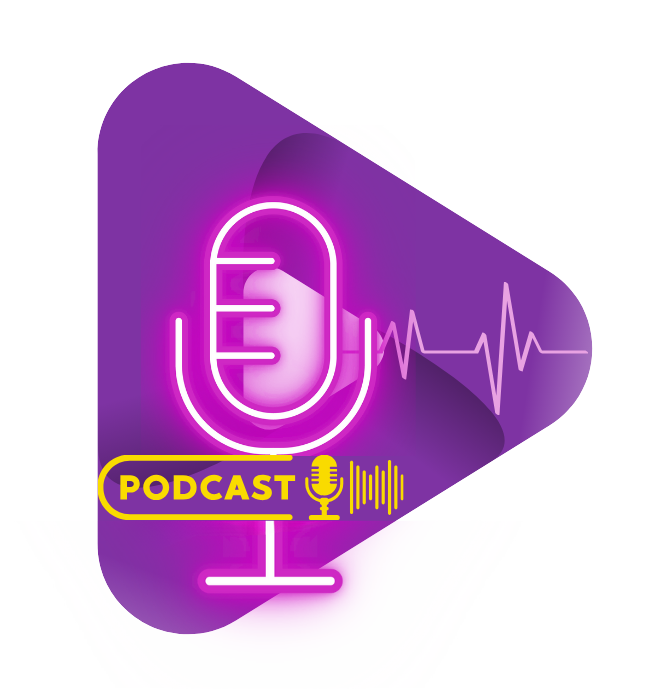

# Be Your Best-Self(ie) Podcast Website



Welcome to **"Be Your Best-Self(ie)"**, the podcast that takes you on a journey to optimal health and wellness! In today's fast-paced world, prioritizing our well-being can often feel like a challenge. But fear not, because here at **"Be Your Best-Self(ie)"**, we're dedicated to providing you with the tools, knowledge, and inspiration to help you live your healthiest and happiest life.

## About

**BE YOUR BEST SELF(IE)** signifies a platform which aims at promoting self-improvement, self-acceptance, and personal growth through the lens of social media and digital self-representation.

Our platform is dedicated to providing a space where individuals can access valuable healthcare remedies and advice straight from seasoned professionals.

From interviews with experienced doctors to discussions on the latest medical advancements, our motive is simple yet profound: to inspire and educate our audience on their path to optimal health and wellness.

## Features

- **Responsive Design**: Optimized for all devices to provide a seamless user experience.
- **Podcast Episodes**: Listen to our latest episodes directly from the website.
- **Healthcare Resources**: Access valuable healthcare remedies and advice.
- **Professional Insights**: Interviews and discussions with seasoned professionals and experienced doctors.
- **Healing Music Podcasts**: Enjoy a selection of healing music podcasts designed to enhance your well-being.
- **Instrumental Music Podcasts**: Listen to soothing instrumental music to relax and rejuvenate.
- **Blog Section**: Read and upload content about health, music, and education, our three content pillars.

## Technologies Used

- HTML
- CSS
- JavaScript

## Getting Started

### Prerequisites

Make sure you have the following installed on your local machine:

- A web browser (e.g., Chrome, Firefox, Safari)
- A code editor (e.g., Visual Studio Code, Sublime Text)

### Installation

1. Clone the repository:

   ```bash
   git clone https://github.com/Aastha204/Be-Your-Best-Self-ie.git
   ```

2. Navigate to the project directory:

   ```bash
   cd Be-Your-Best-Self-ie
   ```

### Running the Application

1. Open the `index.html` file in your web browser to view the website.

## Usage

- Navigate through the website to explore our podcast episodes, healthcare resources, healing music, and instrumental music podcasts.
- Listen to the latest episodes and gain insights from our professional guests.
- Access valuable healthcare advice and remedies to help you on your journey to optimal health and wellness.
- Read and upload blog posts about health, music, and education.

## Contributing

We welcome contributions from the community! If you'd like to contribute, please follow these steps:

1. Fork the repository.
2. Create a new branch:

   ```bash
   git checkout -b feature/your-feature-name
   ```

3. Make your changes and commit them:

   ```bash
   git commit -m "Add your commit message"
   ```

4. Push to the branch:

   ```bash
   git push origin feature/your-feature-name
   ```

5. Open a pull request and describe your changes.

## License

No Licence


Thank you for visiting **"Be Your Best-Self(ie)"**! We hope you enjoy your journey to optimal health and wellness with us.
